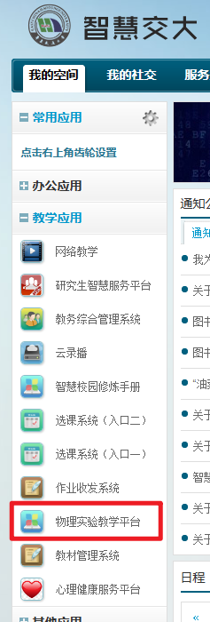
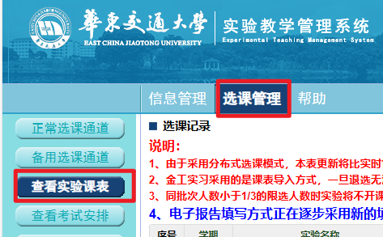
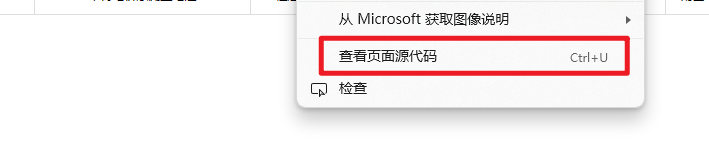
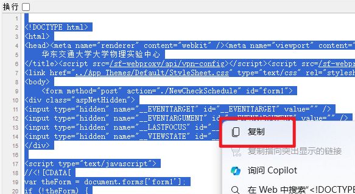
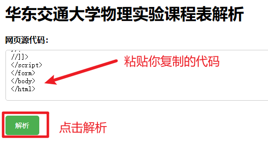

# 物理实验课程表解析

[点我](../README.md)回到首页

## 1. 电脑上登录智慧交大

如图，点击`教学应用`的`物理实验教学平台`

## 2. 进入物理实验课程表

如图，点击`选课管理`，点击侧边栏的`查看实验课表`

## 3. 复制网页源代码

在网页的空白处点击右键，选择`查看页面源代码`

然后我们同时按下`Ctrl`和`A`键执行全选，然后右键点击`复制`

## 4. 解析课程表

打开[这个网页](https://eq_software.gitee.io/analysis-of-the-special-curriculum-schedule-of-ecjtu/wlsyjx.html)

将复制的网页源代码粘贴到`网页源代码`的输入框中，点击`解析`

可以看到提示`解析成功，已经复制到剪切板`

我们打开微信或QQ，粘贴内容发到手机

## 5. 导入数据

内容发给手机后，在手机上复制那串代码，然后进入课程表的`手动导入特殊课表`页面，点击`导入物理实验课表`，粘贴进去点击确定，就完成了导入